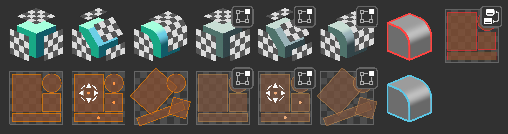

# uvProject Home
!!! warning "Documentation not complete!"
    This documentation is WIP
    
    Estimated completion for uvProject 1.0 around April/May 2025

    Please reach out if you get stuck with anything in the meantime!

Welcome to the uvProject documenttion, here you'll find everything there is to know about the tools.

- [:octicons-download-16: Install uvProject](install.md)
- [:material-run: How to Use](how_to_use.md)

If something isn't clear or is missing please reach out!    
:material-email: <spaghetmenot@gmail.com>   
:fontawesome-brands-bluesky: [@spaghetmenot.bsky.social](https://bsky.app/profile/spaghetmenot.bsky.social)  
:fontawesome-brands-mastodon: [@SpaghetMeNot@mastodon.social](https://mastodon.social/@SpaghetMeNot)

## What is uvProject?

uvProject is a set of tools designed to eliminate many tedious unwrapping tasks. In many cases it allows you to model freely while UVs appear before your eyes.

### Main Features:

1. Oriented UVs. UVs are aligned with object's up axis by default. Ideal for directional textures e.g. bricks, tiles, wood, leaks etc.
2. Stable UVs. Unlike other procedural UV solutions, the projections are stable by default and don't jump around as you change your model* 
3. Live UVs. All projection types are available as modifiers meaning your UVs can be created in real-time as you model.
4. Direct Tools. You can also use the tools directly in mesh edit mode for fast manual UV unwrapping/transforming.

*Stable UVs are designed for tiling materials where UVs can overlap. UV maps that require packing will not be stable.

----
## Where can I get uvProject?
!!! warning "Blender 4.1+ Recommended (Blender 4.0+ Required)"
uvProject is available on Gumroad and will be released on Blender Market for version 1.0

- [:simple-gumroad: Gumroad](https://spaghetmenot.gumroad.com/l/uvproject)   

