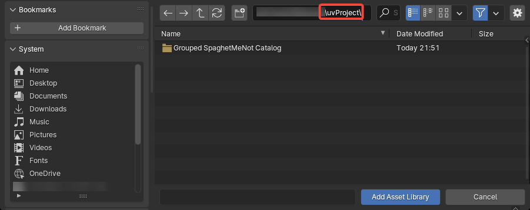

# Install uvProject
uvProject is installed as an asset library in Blender.

Tldr: download the zip, extract the folder, and add the folder as an asset library. For more detailed instructions see [below](#install-asset-library).

!!! info "For more information on asset libraries you can check Blender's [Official Documentation](https://docs.blender.org/manual/en/dev/files/asset_libraries/introduction.html#introduction)"

## Install Asset Library

1. Download latest .zip file for the closest Blender version. (e.g. for Blender 4.1 use "4_1_xxxx.zip")
2. Unzip/extract folder to your desired location
3. Open Blender and go to Edit/Preferences/File Paths/Asset Libraries
4. Click + Add Asset Library 
5. Navigate to the unzipped folder and press Add Asset Library. (Make sure you are in the "uvProject" Folder) 
6. Save Preferences and **restart Blender** for modifiers/tools to show up in menus

After Restarting Blender you should have access to the uvProject tools:

1. With an mesh selected in the 'Add Modifier' Menu
2. in the Edit Mesh 'UV' Menu
3. Geometry Nodes Add Node menu under 'UV'

## Alternative Catalog
By default, the assets are organized into generic categories to make using them feel more native within Blender. 

I've included an alternate catalog that groups everything under a "SpaghetMeNot" catalog to keep all my nodes together. This may be preferable if you have lots of node asset libraries. 

To use this simply replace blender_assets.cats.txt with the version found inside the Grouped SpaghetMeNot Catalog Folder: